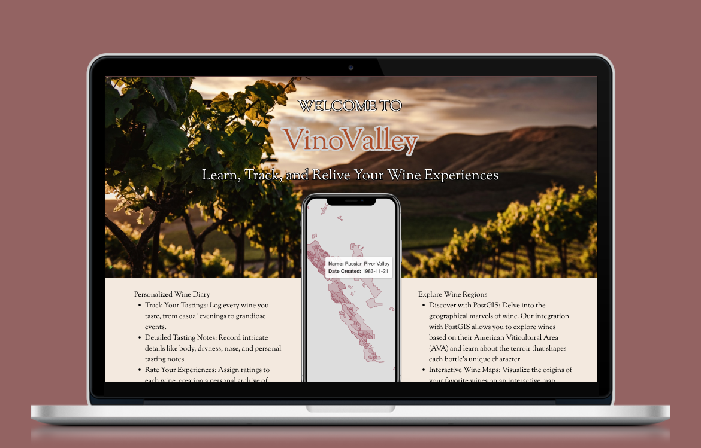

# VinoValley

Learn, Track and Relive your Wine Experiences

## Features

### Personalized Wine Diary

- Track Your Tastings: Log every wine you taste, from casual evenings to grandiose events.
- Detailed Tasting Notes: Record intricate details like body, dryness, nose, and personal tasting notes.
- Rate Your Experiences: Assign ratings to each wine, creating a personal archive of your preferences.

### Explore Wine Regions

- Discover with PostGIS: Delve into the geographical marvels of wine. Our integration with PostGIS allows you to explore wines 
based on their American Viticultural Area (AVA) and learn about the terroir that shapes each bottle’s unique character.

- Interactive Wine Maps: Visualize the origins of your favorite wines on an interactive map, connecting taste to terrain.

## Vision

## Citations

American Viticultural Areas Digitizing Project Team. 2021. https://github.com/UCDavisLibrary/ava Accessed 2024.